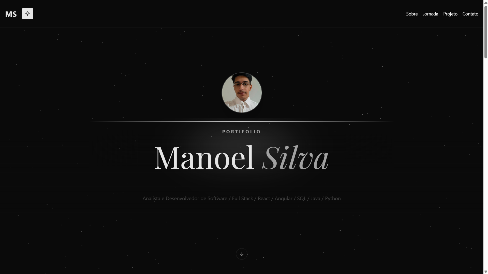

# 🚀 Meu Portfolio

Um portfólio moderno, interativo e responsivo desenvolvido para apresentar meus projetos, habilidades e trajetória profissional. Focado em UX/UI com animações fluidas.



## 🛠️ Tecnologias Utilizadas

Este projeto foi construído utilizando as ferramentas mais recentes do ecossistema React:


*   **Core:** React 19, TypeScript, Vite
*   **Estilização:** Tailwind CSS v4
*   **Componentes UI:** Shadcn/ui, Acertenity UI
*   **Animações:** Framer Motion
*   **Roteamento:** React Router Dom v7
*   **Ícones:** Lucide React, React Icons

## ✨ Funcionalidades

*   🎨 **Design Moderno:** Tema escuro (Dark Mode) com elementos visuais ricos (efeitos de brilho, cards 3D, partículas).
*   📱 **Totalmente Responsivo:** Layout adaptável para dispositivos móveis, tablets e desktops.
*   🖼️ **Galeria de Projetos:** Visualização detalhada de projetos com carrossel de imagens e tooltips interativos.
*   🚀 **Jornada Profissional:** Linha do tempo interativa mostrando experiência e educação.
*   ⚡ **Performance:** Otimizado com Vite para carregamento rápido.

## 📂 Estrutura do Projeto

```bash
src/
├── assets/        # Imagens e recursos estáticos
├── components/    # Componentes reutilizáveis (Header, Cards, UI blocks)
│   ├── projects/  # Componentes específicos da seção de projetos
│   └── ui/        # Biblioteca de componentes (Shadcn/Acertenity)
├── data/          # Arquivos de dados estáticos (textos, listas)
├── hooks/         # Custom Hooks
├── pages/         # Páginas da aplicação
├── routes/        # Configuração de rotas
└── lib/           # Utilitários e funções auxiliares
```

## 🚀 Como Executar Localmente

Siga os passos abaixo para rodar o projeto em sua máquina:

1. **Clone o repositório:**
   ```bash
   git clone https://github.com/ManoelJonathan/Portifolio.git
   ```

2. **Entre na pasta do projeto:**
   ```bash
   cd Portifolio
   ```

3. **Instale as dependências:**
   ```bash
   npm install
   # ou
   pnpm install
   # ou
   yarn install
   ```

4. **Inicie o servidor de desenvolvimento:**
   ```bash
   npm run dev
   ```


